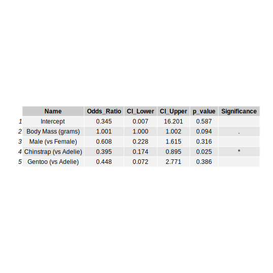

```{r setup, include=FALSE}
knitr::opts_chunk$set(echo = TRUE) #this makes the document default to have echo = TRUE
```

## QUESTION 01: Data Visualisation for Science Communication

*Create a figure using the Palmer Penguin dataset that is correct but badly communicates the data. **Do not make a boxplot**.*

### a) Provide your figure here:

```{r bad figure, echo=FALSE, message=FALSE, warning=FALSE, results="hide"}

# Make sure your figure is visible after you knit it. 

library(here)
library(tidyverse)
library(janitor)
library(dplyr)
library(knitr) 
library(rmarkdown) 
library(here) 
library(tidyverse) 
library(janitor)
library(ggplot2)
library(tinytex)

source(here("functions", "cleaning.r"))
  
penguins_untidy <- read_csv(here("data", "penguins_raw.csv"))
  
penguins_tidy <- penguins_untidy %>%
    cleaning_columns() %>% #automatically snake case
    shorten_species() %>%
    remove_empty_columns_rows() %>% 
    remove_NA() 
  
  
ggplot(data = penguins_tidy, aes(x = date_egg, y = body_mass_g)) +
    stat_smooth(method = "lm", se = FALSE, color = "darkred", 
                geom = "line", 
                linewidth = 1,  # Increase line thickness
                arrow = arrow(length = unit(0.2, "cm"), ends = "last", type = "closed")) +
    geom_point(color = "darkred", alpha = 0.2) +
    coord_fixed(ratio = 2) +
    theme_bw() +
    theme(axis.text.y = element_blank()) +
    scale_y_continuous() +
    coord_cartesian(ylim = c(4150, 4300)) +
  
      scale_x_date(
      breaks = as.Date(c("2008-01-01", "2008-07-01", "2009-01-01", "2009-07-01", "2010-01-01")),
      labels = c(expression(bold("2008-01")), "2008-07", "2009-01", "2009-07", "2010-01"),
      expand = expansion(mult = c(0.05, 0.09)) # padding on both ends of the x-axis
    ) +
    labs(
    title = "Palmer Penguin Body Mass over Time",
    x = "Time since Chef Smith's Arrival",
    y = "Body Mass (g)"
  )
```

<br>

### b) Write about how your design choices mislead the reader about the underlying data (100-300 words).

Imagine a scenario where I am in an argument with Chef Smith, who was hired at the start of 2008 to my Antarctic field station workplace. I devise a plan to get them fired by convincing the public that their food waste is causing an obesity epidemic around Palmer Station, Antarctica LTER. Taking to twitter, I share the above graph.

Points of deception:

-   I have started the y-axis from where the linear relationship begins, rather than 0 or another appropriate point. This exaggerates the steepness of the linear relationship, which would look almost negligible if seen as it should be.

-   I am only using the species Gentoo, but extrapolating to all Palmer Penguins in the title. In fact, Adelie Penguins have got smaller since Chef Smith's arrival. (N.B. I am taking the graph title and axis labels to be "visual elements").

-   I have elected to make the line red, a colour commonly associated with negatives. This aims to distract from the fact that weight increase isn't intrinsically negative.

-   I have made the line an arrow. This aims at convincing the reader of a continued projected increase should Chef Smith remain employed.

-   Rather than labeling with the objective "Date", I have drawn attention to unfairly influence the reader by measuring from time since Chef Smith's arrival.

-   I have used the code "coord_fixed(ratio = 10)" which stretches the graph vertically and hugely exaggerates the steepness of the line.

-   I have made the individual label 2008-01 bold. I did this while ensuring the axes remain the same as when they are entered in a repeatable manner, so it remains technically "correct". The intended effect is to again call attention to the false association between Chef Smith's arrival and increased penguin body mass.

-   I used `scale_y_continuous()` along with `coord_cartesian(ylim = c(x1, x2))`. This enabled me to manipulate the y axis, while `coord_cartesian()` ensured that the "zoom effect" excludes the data points from the graph but not the `lm()`. This circumvents an issue where it looks too obviously fabricated without any data visible.

<br>

------------------------------------------------------------------------

## QUESTION 2: Data Analysis Pipeline

------------------------------------------------------------------------

### 1 Introduction

#### 1.1 What is the data?

The data features various pieces of information gathered on three species of Penguins around Palmer Station, Antarctica. Collected variables include geographical data, various morphological characteristics, and details on reproductive success.

<br>

#### 1.2 Load libraries

I start by loading the libraries we will be using. To protect the environment, I will be using `renv()`. It ensures the packages we use have a record of which version was being used at the time we write our code. This prevents subsequent updates to packages from affecting our code's functionality. Users can use `renv::status()` to ensure the packages are correctly loaded in a consistent state.

I considered loading packages in a separate file and importing them with `source()`. However, I decided not because readers would then be forced to open an additional file which would reduced the level of transparency within the .Rmd file.

```{r Libraries, echo=TRUE, message=FALSE, warning=FALSE}
# Make sure your code prints.

library(renv) 
library(knitr) 
library(rmarkdown) 
library(here) 
library(tidyverse) 
library(janitor)
library(tinytex)
library(svglite)
library(ragg)
library(car)
library(MASS)
library(gridExtra)
library(grid)

renv::status()
```

<br>

#### 1.3 Load and visualize data

The data was loaded from the `palmerpenguins` package and then saved in the file `data`. Rather than repeating that process in the pipeline, I pushed the file to my GitHub Repository from where readers can download it. More often in practice, researchers will be downloading data rather loading it from R packages, making this a more applicable step in the pipeline.

I can then visualize the data with the `read_csv()` function, contained in tidyverse and producing a "tibble". Tibbles are a "modern take on data frames" (R Core Team, 2024). The `here()` function avoids privacy concerns by sidestepping entering file directories and improves operating system cross-compatibility.

```{r Data Exploration}
penguins_raw <- suppressMessages(read_csv(here("data", "penguins_raw.csv"), show_col_types = FALSE))

head(penguins_raw)
```

<br>

#### 1.4 Cleaning data

Next in the pipeline, we can look specifically at the column names.

```{r}
colnames(penguins_raw)
```

<br>

It is apparent from the mixture of styles (e.g. camel case and sentence case) and abundance of error-causing characters (e.g. spaces, brackets, and slashes) that we should clean our dataset. Here, it is important to resist the urge to edit the raw data, as this ruins reproducibility. Instead we should make a new cleaned dataset.

```{r data cleaning}
source(here("functions", "cleaning.r"))

penguins_clean <- penguins_raw %>%
  cleaning_columns() %>% #automatically snake case
  shorten_species() %>%
  remove_empty_columns_rows() %>% 
  remove_NA() 

colnames(penguins_clean)

```

<br>

The above code begins by sourcing a file named `cleaning.r` from within our directory. It uses Dr France's functions for cleaning the data, which themselves use cleaning functions from the "janitor" package. By using `source()` and a separate file, we streamline our work by ensuring any functions which may be used multiple times in the project only need to be edited in one place. The code also makes use of a "pipe" (`%>%`), here styled as part of the `tidyverse` package. It is essentially equivalent to the instruction "and then".

<br>

#### 1.5 Create an Exploratory Figure

I am interested in whether there is any relationship between the categorical variable `clutch_completion` and `body_mass_g`. More specifically, I am interested in whether body mass as an explanatory variable has any noticeable influence on fitness, for which I will use clutch completion as a proxy. I expect this to naturally vary between species and sex, so want to control for those factors.

Next in my data pipeline, I will subset the data into these factors of interest with the `select()` function.

```{r data subset}
body_mass_clutch <- penguins_clean %>%
  dplyr::select(species, body_mass_g, sex, clutch_completion) #specify package as MASS has conflict

```

<br>

Rather than using a boxplot, I use a violin plot. This is another useful exploratory graph technique with a bigger focus on data distribution compared to a boxplot's focus on summary statistics.

```{r explanatory figure}
#combine data columns into one for colour coding the graph. Make new dataset to avoid overwriting

body_mass_clutch_updated <- transform(body_mass_clutch, 
                                      species_clutch = paste(species, clutch_completion, sep = "_"))
  
  species_shades <- c(
    "Adelie_No" = "#006d4c",  
    "Adelie_Yes" = "#66c2a4", 
    "Chinstrap_No" = "#ff8c66",  
    "Chinstrap_Yes" = "#ffb399", 
    "Gentoo_No" = "#c653c6",  
    "Gentoo_Yes" = "#ecc6ec"
  )
  
  
violin_plot <- ggplot(body_mass_clutch_updated, aes(x = clutch_completion, y = body_mass_g, fill = species_clutch)) +
    geom_violin() +
    stat_summary(fun = mean, geom = "crossbar", width = 0.9, linewidth = 0.2, color = "black") + # add mean lines
    facet_wrap(~species) +
    scale_fill_manual(values = species_shades) + # use custom color scheme
    labs(title = "Body Mass by Clutch Completion for Each Species",
         x = "Clutch Completion",
         y = "Body Mass (g)",
         fill = "Species and Clutch Completion") + 
    theme_bw() +
    theme(
      legend.position = "none",
      strip.text = element_text(size = 12),
      ) +
  geom_jitter(
        aes(color = ),
        alpha = 0.1,
        show.legend = FALSE, 
        position = position_jitter(width = 0.2, seed = 0)) # seed number to add reproducibility

print(violin_plot)

```

I considered adding the plotting code to a function file. However, since I am only required to do this one plot, I decided it is simpler to display the code in the document.

The code contains a number of steps to ensure the data is communicated in a clear way.

-   I begin by creating a new dataset (avoiding overwriting) with a new column that contains information on both the species and clutch completion. This allows me to colour plots individually down the line.

-   I then code the plot itself. I begin by plotting the violin plot while faceting for species, a variable I see as likely important for weight independently and this is supported by the graph.

-   As an exploratory figure, I employ `geom_jitter()` to show the raw data, along with setting a seed for reproducibility.

-   `stat_summary()` is used to add the mean, which I feel is a helpful visual comparison.

We can see from the figure that Gentoo penguins tend to be larger. In all three species the majority of penguins complete a clutch, as is shown by the greater number of data points in each `Yes` position. Within each species, the mean body mass for successful clutch completion appears similar to unsuccessful cases.

<br>

#### 1.6 Save the exploratory figure.

```{r saving explanatory figure}
save_plot_svg <- function(plot, 
                                  filename, size, scaling){
    size_inches = size/2.54
    svglite(filename, width   = size_inches, 
                      height  = size_inches, 
                      scaling = scaling)
    print(plot)
    dev.off()
}

save_plot_svg(violin_plot, 
                       here("figures", "violin_plot.svg"), 
                       size = 19, scaling = 1.5)
```

I used a function covered in the computer class. I then used the function to save the plot, setting the size to be optinal for viewing the graph full-screen on a computer.

<br>

### 2 Hypotheses

$\text{H}_0 :$ Body mass has no significant effect on the probability of clutch completion.

$\text{H}_{a1} :$ Penguins with greater body mass have significantly higher probability of clutch completion.

$\text{H}_{a2} :$ Penguins with greater body mass have significantly lower probability of clutch completion.

<br>

### 3 Statistical Methods

I model the data using a binomial logistic regression with `clutch_completion` as the response variable.

$$\\ln\left(\frac{p_i}{1 - p_i}\right) = \beta_0 + \beta_1 X_1 + \beta_2 X_2 + \dots + \beta_n X_n$$

I include the variables sex and species as those potentially able to influence clutch completion. Controlling for these potential influences could improve the power of the model.

```{r Statistics}
#convert completion into 1 = yes, 0 = no.
body_mass_clutch_updated$clutch_completion_binary <- ifelse(body_mass_clutch$clutch_completion == "Yes", 1, 0) # new column to allow binomial logistic model 

logistic_regression_model <- glm(clutch_completion_binary ~ body_mass_g + sex + species, 
             family = binomial(link = "logit"), 
             data = body_mass_clutch_updated)

summary(logistic_regression_model)
```

Above, I create a new column in the dataset `body_mass_clutch_updated` with values `Yes` and `No` converted to `1` and `0`, respectively. This allows the binomial logistic regression to run, which uses `glm()`. A linear model uses the a direct link function, to make predictions on the response scale. The binomial logistic regression uses the `logit` link function, which converts predictions to the probabilistic log-odds scale. To discuss the results, it is common practice to exponentiate the coefficients in order to interpret them as odds-ratios.

<br>

#### 3.1 Checking model assumptions

I start with with multicollinearity. Sexes and species can tend to be collinear with size. If this is the case, it could make our model results appear stronger than they should through a form of double counting.

```{r}
vif(logistic_regression_model)
```

The variance inflation factors (`vif()`) indicate moderate multicollinearity between body mass and the other two factors. It is not so extreme as to necessitate excluding any variables from the model. Instead we should be cautious about multicollinearity's potential bias when interpreting the model.

<br>

##### 3.1.1 Over-fitting

To guard against over-fitting, I will use a stepwise test to remove non-significant factors based on AIC criteria. As this model contains few factors and a good sample size, this is unlikely to be a major concern. The check for over-fitting is worth putting in our pipeline process, however, as a good habit.

```{r show-code-hide-output, results = "hide"}
stepwise_model <- stepAIC(logistic_regression_model, direction = "both")

```

```{r}
summary(stepwise_model)
```

In both the selected model and the full model, the comparison between Adelie and Gentoo species is the only statistically significant factor for predicting clutch completion. The difference in AIC scores is minimal, indicating either model can be chosen.

<br>

##### 3.1.2 Independence

To check for independence, it can often be useful to plot collection against time. I make a function for this and run it below.

```{r}
plot_independence <- function(data, time_col, value_col) {
  set.seed(0)
  
ggplot(data, aes(x = .data[[time_col]], y = .data[[value_col]])) +
  geom_point(alpha = 0.6) +
  labs(
    x = "Time",
    y = "Observed Value",
    title = "Check for Independence Over Time"
    ) +
  scale_x_date(expand = expansion(mult = c(0.05, 0.09))) + # padding on both ends of the x-axis 
    theme_bw()
}

plot <- plot_independence(
  data = penguins_clean,
  time_col = "date_egg",
  value_col = "body_mass_g")

print(plot)
```

<br>

##### 3.1.3 Linear relationship

Finally, we should check the assumption of a linear relationship between continuous explanatory variables and the logit of the response variable with a Box-Tidwell Test.

```{r}
boxTidwell(clutch_completion_binary ~ body_mass_g, data = body_mass_clutch_updated)
```

The p-value indicates that we fail to reject the null hypothesis that the relationship is linear. In other words, the linearity assumption is not violated.

<br>

### 4 Results & Discussion

"*A results figure demonstrates the stats method chosen, and includes the results of the stats test or model."*

#### 4.1 Results

```{r Plotting Results, message=FALSE}

# Make sure your code prints. 


# extract typical statistics used to interpret model
coefficients <- summary(logistic_regression_model)$coefficients #extract coefficients 
odds_ratios <- exp(coefficients[, "Estimate"])  #find odds-ratios by taking exponential
conf_int <- exp(confint(logistic_regression_model))  # confidence intervals for odds ratios

results_df <- data.frame(
    Name = c(
    "Intercept",
    "Body Mass (grams)",
    "Male (vs Female)",
    "Chinstrap (vs Adelie)",
    "Gentoo (vs Adelie)"
  ),
  Odds_Ratio = odds_ratios,
  CI_Lower = conf_int[, 1],
  CI_Upper = conf_int[, 2],
  p_value = coefficients[, "Pr(>|z|)"],
  stringsAsFactors = FALSE
)

results_df$Odds_Ratio <- formatC(results_df$Odds_Ratio, format = "f", digits = 3)
results_df$CI_Lower <- formatC(results_df$CI_Lower, format = "f", digits = 3)
results_df$CI_Upper <- formatC(results_df$CI_Upper, format = "f", digits = 3)
results_df$p_value <- formatC(results_df$p_value, format = "f", digits = 3)

results_df$Significance <- cut(as.numeric(results_df$p_value),
                               breaks = c(-Inf, 0.001, 0.01, 0.05, 0.1, Inf),
                               labels = c("***", "**", "*", ".", " "))

# remove non-human readable row names
rownames(results_df) <- NULL


# view data frame as tibble in .Rmd
results_df
```

-   The above code begins by extracting the relevant estimates, covered in [3 Statistical Methods].

-   I then create a data-frame which contains the extracted estimates along with humanly readable row names.

-   I reduce the number of significant figures to improve the readability.

-   I add a standard code to show the significance of any p_values.

-   Finally, I hide the original row names and create the tibble seen above.

<br>

##### 4.1.1 Saving table

Next I will make a new function to save the table. This requires the additional package `gridExtra`.

```{r saving table as SVG}


save_table_svg <- function(table, filename, size, scaling, title = NULL, vjust = NULL) {
    size_inches = size / 2.54  # convert cm to inches
    svglite(filename, width = size_inches, height = size_inches, scaling = scaling)
    
    if (!is.null(title)) {
        # create a title grob with the calculated vjust
        title_grob <- textGrob(
            title, 
            gp = gpar(fontsize = 14, fontface = "bold"),
            vjust = vjust
        )
        
        # arrange title and table heights in the output
        grid.arrange(title_grob, tableGrob(table), heights = c(1, 10))
    } else {
        # avoid errors if no title
        grid.table(table)
    }
    
    dev.off()  # close device
}


save_table_svg(
    results_df,
    here("figures", "table.svg"),
    size = 19, 
    scaling = 1,
    title = "Results Table of Binomial Logistic Model",
    vjust = 18)  # custom vertical for title independent of table
```



Here is the table, inserted as an image and available on GitHub.

<br>

### 5 Discussion

The results show that there is no statistically significant effect of body mass on clutch completion. The probability our ratio of successes to failures occurred by random chance is 0.0940.

The confidence intervals for `Body Mass` are of interest. They are extremely narrow around an odds-ratio of 1, which would indicate no difference in the probability of clutch completion. The data shows that there is \~90% confidence that the odds-ratio does not overlap one, which is nearly statistically significant. However, the biological significance would nevertheless be negligible since the expected value (=1.001) is so close to 1.

For species, we can imagine their different ecologies contributing to different clutch survivals. Perhaps the Chinstrap is able to dominate Adelie for a preferable niche if they coexist. Chinstrap penguins could be more k-selected than Adelie. However, we normally expect larger penguins, like Gentoo, to be more k-selected and yet they are not more likely to have a successful clutch according to the data.

The model met most of its assumptions. The independence would have been better if sampling had not taken place in such short time-windows. We could imagine a scenario where different life-histories mean Chinstrap clutches are more firmly established as complete at a later point than December when these species are consistently being sampled, for example if offspring morality is far higher some time after data recording but before true clutch completion.

The moderate multicollinearity can be ignored as the step-wise model with only the Chinstrap shows essentially the same results as when the other factors are included.

<br>

### 6 Conclusion

Overall, we have been able to create a valid model which supports our null hypothesis that there is no significant difference in the probability of clutch completion according to body mass. Even if the sample size was increased and showed a statistically significant effect, its biological relevance is still likely negligible. This result is perhaps slightly surprising since we often associate larger body mass with a better fitness. Further study may wish to investigate why this is not the case for these species of penguin.

<br>

------------------------------------------------------------------------

## QUESTION 3: Open Science

### a) GitHub

*Upload your RProject you created for **Question 2** and any files and subfolders used to GitHub. Do not include any identifiers such as your name. Make sure your GitHub repo is public.*

*GitHub link: <https://github.com/Anonymous-Exam-User/Palmer_Penguin_GitHub>*

*You will be marked on your repo organisation and readability.*

### b) Share your repo with a partner, download, and try to run their data pipeline.

*Partner's GitHub link: <https://github.com/lemontea63/reproducible_figures_assignment>*

*You **must** provide this so I can verify there is no plagiarism between you and your partner.*

<br>

### c) Reflect on your experience running their code. (300-500 words)

-   *What elements of your partner's code helped you to understand and run their data pipeline?*

My partner has extensively annotated their code, explaining what each line does in most cases. This helps understanding. By following the template, running their data follows a logical sequence. YAML headers also help understand what each chunk is for.

-   *Did it run? Did you need to fix anything?*

Broadly, yes the code ran. I first encountered an issue with the first library chunk, running `renv::restore()`, which should install the correct packages from the lockfile; however, I noticed some discrepancies. I got around this by just installing the most recent required packages with `renv::install()` . This works for now; however, isn't ideal for long-term reproducibility.

`renv::status()` revealed that "the lockfile was generated with R 4.4.1, but you're using R 4.2.2". This didn't seem to cause any issues and, if it did, it would fall on me to align the versions.

I moved on to data preparation, which immediately gives an error:

```         
> head(penguins_data_raw)
```

```         
-Error in tempfile(pattern = "_rs_rdf_", tmpdir = outputFolder, fileext = ".rdf") : 
```

```         
-temporary name too long
```

I circumvented this by re-extracting the repo to my Documents file, instead of a deeply nested OneDrive file. This fixed the issue.

When trying to run the data preparation chunk (line 134), it would not run when using the Run Current Chunk button. I was getting errors around text being part of the chunk. It was solved by adding a line break between the above section and the code chunk.

-   *What suggestions would you make for improving their code to make it more understandable or reproducible, and why?*

I find the in-code descriptions more difficult to read than the text sections. Personally, I think breaking the coding chunks into smaller segments and moving annotations to a text format would make the code more understandable. Additionally, where direct code annotations are preferable, such as for a minor annotation, I think the ease of understanding is improved if annotations immediately proceed the code, rather than all being found at the start of the coding sequence.

I think the code would be more readable if indents were smaller in some cases, such as with ggplot. The large indents followed by lines that over-run the line make following the logic more challenging to me.

When initially cleaning data, `na.omit()` is not included which causes some warning messages. It is used later when subsetting the data.

In the statistics chunk (line 337), the chunk produces two plated plots of Q-Q and Residuals vs Fitted. These seem almost identical and the cause for small difference between them is not obvious from the code. This does not make the user confident in the graph's reproducibility.

References are difficult to read in the bibliography and might have benefited from using Quarto's referencing capabilities.

-   *If you needed to alter your partner's figure using their code, do you think that would be easy or difficult, and why?*

I think the biggest obstacle to altering my partner's code would be the overall readability. Editing small, easily visible components like a title in a graph or colour would likely be easy. However, higher level, conceptual changes would likely be more difficult as a consequence of the formatting.

<br>

### d) Reflect on your own code based on your experience with your partner's code and their review of yours. (300-500 words)

-   *What improvements did they suggest, and do you agree?*

My partner's main suggestion was that I could be more concise. I'm sure this is true. In the translated words of Blaise Pascal, "I have made this letter longer than usual because I lack the time to make it shorter". Their point about including more code annotations is synergistic with this point, as in future I should consider more whether a wordy explanation can be better worked with a simple annotation. That said, statistics can be complex and this will not always be the best case.

They suggested having a tidier cleaning.r file, which I completely agree with. I structured it as it was because the segment was not taken from the file verbatim. However, since I edited the code anyway, it would be easier to follow if I just attributed it all to the original author and made clear than slight changes had been made.

-   *What did you learn about writing code for other people?*

Throughout this I learned a great deal about writing code for other people, not least being future me! Learning about `renv()` was extremely helpful and helped me understand why my old projects weren't working each time I tried to re-load them.

I learned about making and maintaining a GitHub Repository. By setting this up in the first instance, interested readers will be able to audit my commits and see the process of making my work, as well as the finished product. Unfortunately I had to delete my initial repository which showed edits from the very beginning due to accidentally "doxxing" myself. This resulted from having my anonymous GitHub account paired with the terminal but my usual GitHub account paired with Git Bash, from which the RStudio Git tab runs. I learned to check which user is signed in to Git Bash before pushing sensitive files.

As I was worried about how the code would run elsewhere, I decided to boot a virtual machine with a different operating system (MacOS) and test how my code would run there. I think doing that was helpful in ensuring broad compatibility and perhaps that could become a part of data pipelines in future.
